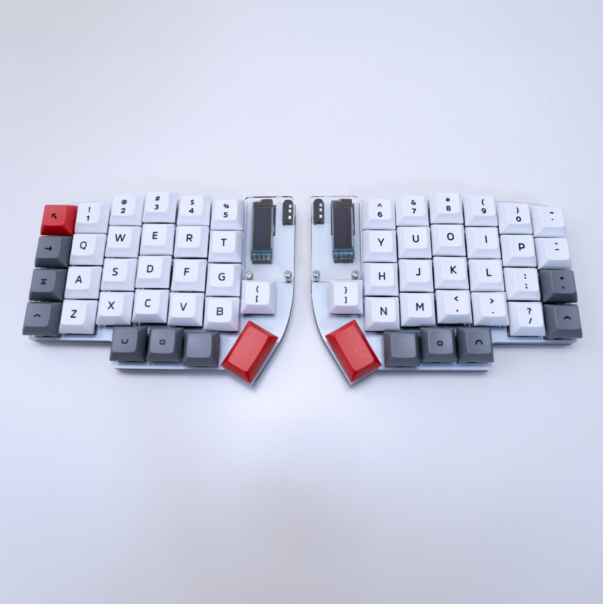
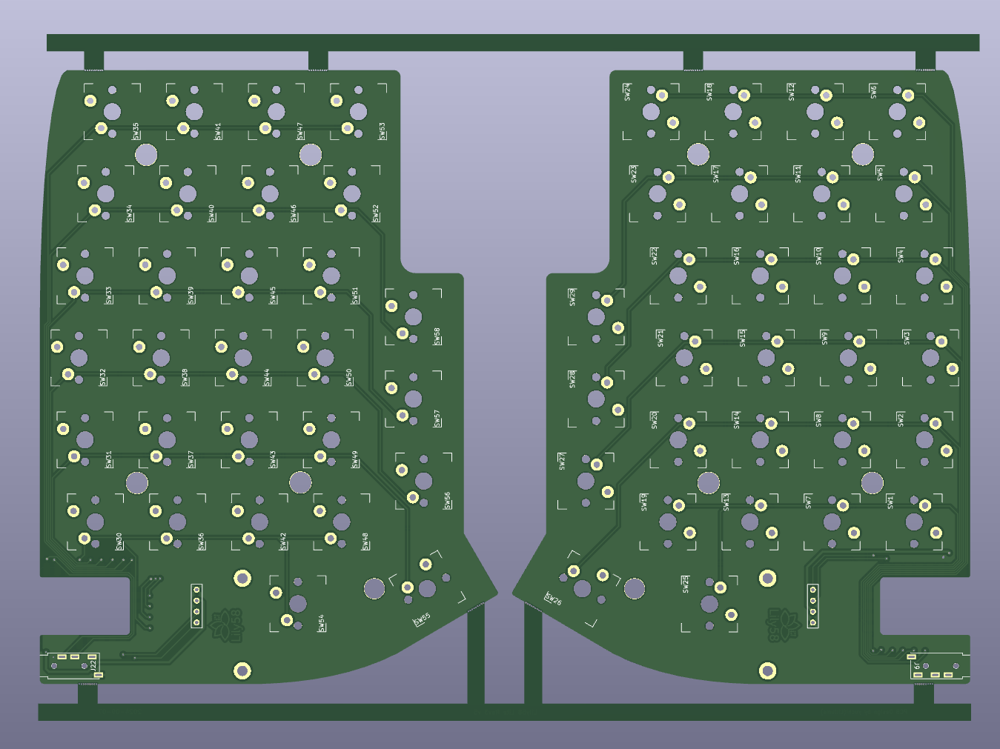
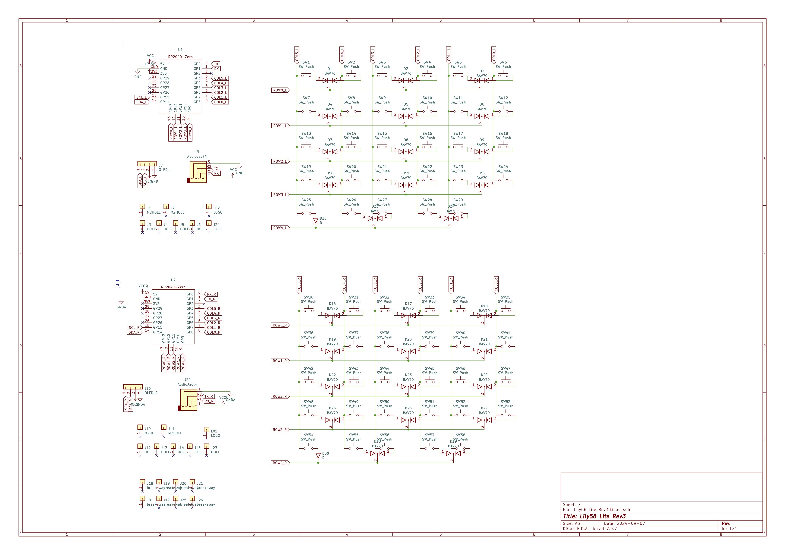

# Lily58 Lite Rev3

### description
- Controller: RP2040-Zero
- Firmware: QMK Firmware

### Assembly Guide
- https://docs.liliums.net/lily58-lite-rev3/about/ (RP2040 installed kit Version)

### Shop
- https://shop.liliums.net/products/lily58-lite-rev3
- https://shop.yushakobo.jp/products/9651