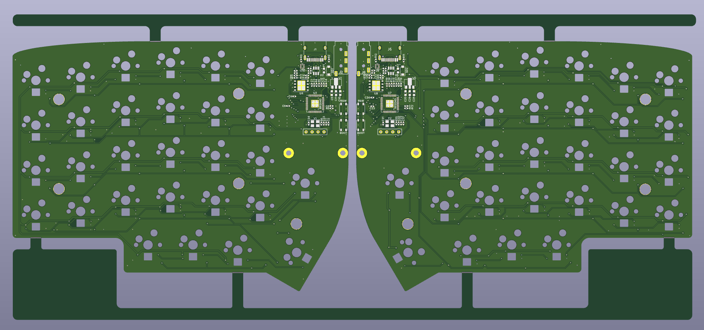

# Lily58 Pro v2

### description
- MCU: [RP2040](https://www.raspberrypi.com/documentation/microcontrollers/rp2040.html)
- PCBA Design
- Backlight Support
- Firmware: QMK Firmware

### Shop
- TBA

### Features
- Choc V2 Switch Support