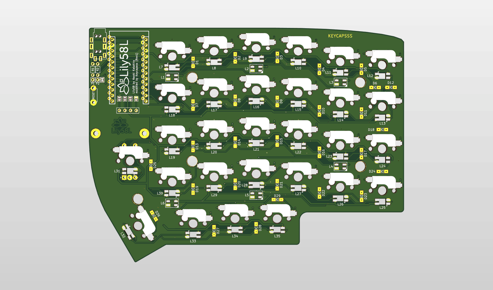
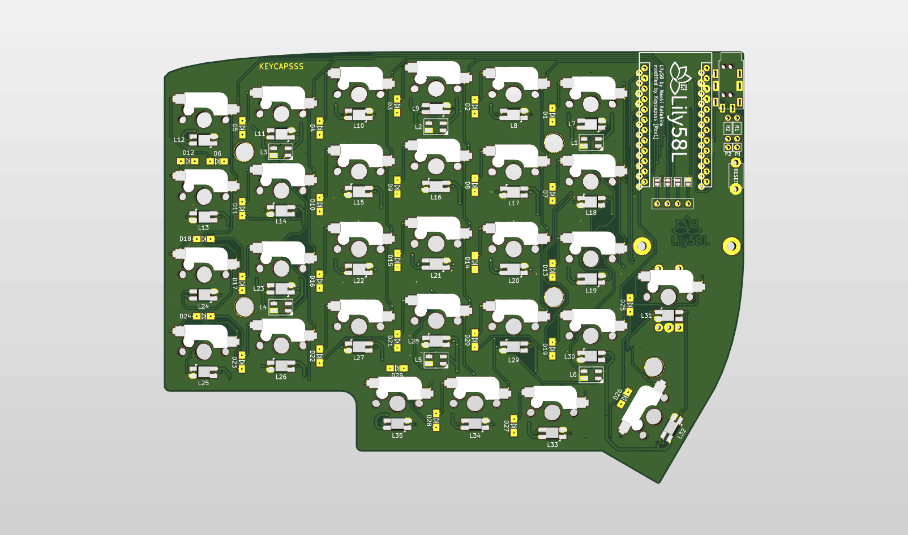

# Lily58L
Lily58L is 6×4+4keys column-staggered split keyboard.

It is a modified version of the Lily58 Pro pcb from [kata0510](https://github.com/kata0510)
and has the the following additional features.
- one rotary encoder support on each side
- underglow with SK6812 Mini RGB led's (6 per side)
- per key RGB led with SK6812 Mini-E led (with legs, easy to solder)

**[Build-Guide](buildguide_en.md)**

**Hardware available at [keycapsss.com](https://keycapsss.com)**

# Parts

Part name | Quantity | Remarks | Photo |
| ------- | -------- | ------- | ----- |
| Lily58L PCB | 2 pcs ||
| Lily58L case | 1 set | 2 solid panels, 2 with holes for switches |
| [Pro Micro](https://keycapsss.com/keyboard-parts/parts/79/arduino-pro-micro-atmega32u4-controller) or [Elite-C](https://keycapsss.com/keyboard-parts/parts/99/elite-c-pro-micro-replacement-with-usb-c-and-atmega32u4) | 2 pcs (a mix is possible) | Optionally, use [Mill-Max Single Row Socket Headers](https://keycapsss.com/keyboard-parts/parts/100/single-row-socket-headers-pins-mill-max-series-315), to make it hot-swappable. ||
| Key switch (MX) | 58 pcs |  ||
| [Kailh switch socket](https://keycapsss.com/keyboard-parts/parts/49/kailh-hot-swap-pcb-sockets-10-pcs) | 58 pcs |  ||
| Diodes 1N4148W (SMD) | 58 pcs |||
| TRRS jack | 2 pcs ||
| Tactile switch | 2 pcs | Reset switch ||
| TRRS cable | 1 cable | Must be a 4-pole cable ||
| Key caps | 58 pcs | 1.5U caps, can also be 1U ||
| Micro USB or USB-C cable | 1 pcs | Dependent what you use on the master half. ||

## Optionally:

Part name | Quantity | Remarks | Photo |
| ------- | -------- | ------- | ----- |
| [OLED module](https://keycapsss.com/keyboard-parts/parts/80/ssd1306-oled-lcd-display-0.91-inch-128x32-i2c-white) | 2 pcs | It is possible to use only one display ||
| SK6812 Mini | 12 pcs | RGB led's for underglow ||
| SK6812 Mini-E | 58 pcs |RGB led's for keycap backlight **(underglow led's must be soldered, because they are connected in series)** ||

## Firmware:

**Right now the Lily58L code is not merged into QMK Master. You can find the code [here](https://github.com/BenRoe/qmk_firmware/tree/Lily58L/keyboards/lily58l).**

 
Clone/download the Lily58L firmware branch and execute the following in the `qmk_firmware` directory to write the default Lily58L keymap

    git checkout Lily58L
    qmk compile -kb lily58l -km default   